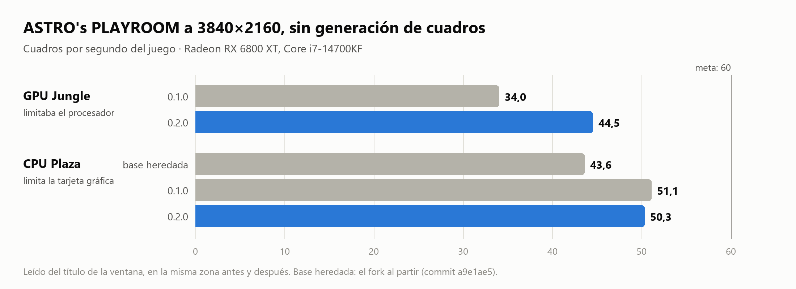
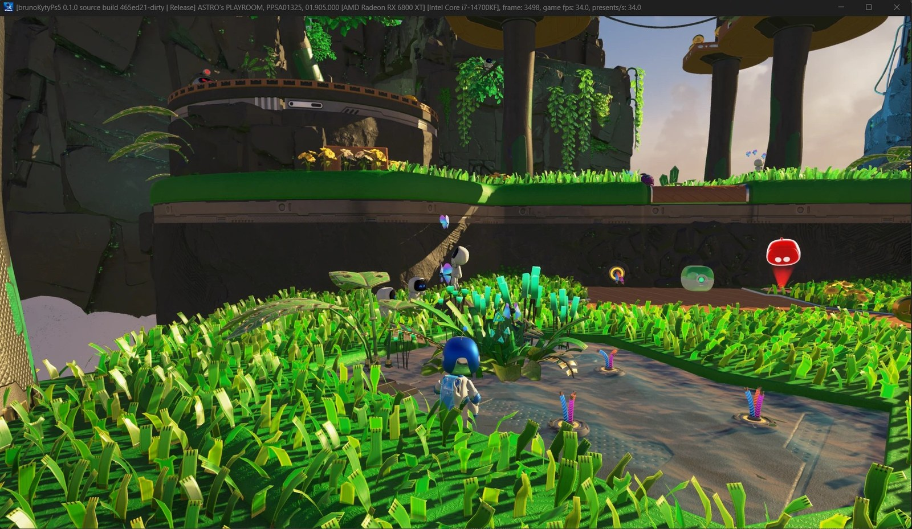
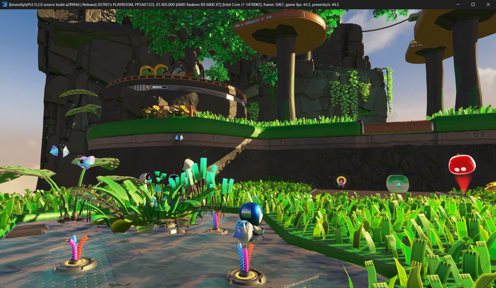
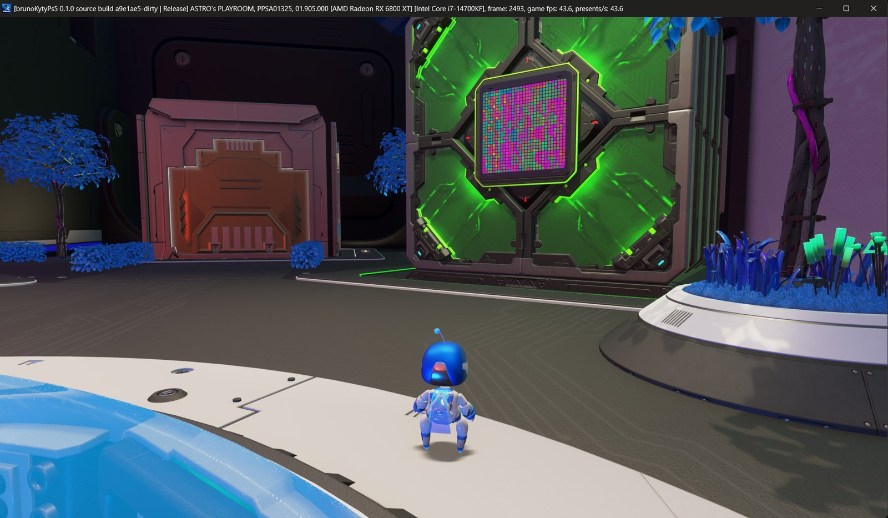
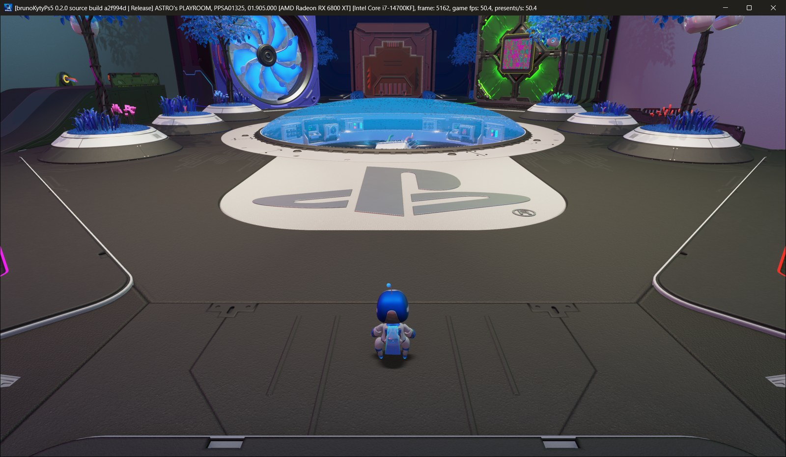

# brunoKytyPs5

Fork del emulador de PlayStation 5 [KytyPS5](https://github.com/KytyPS5/KytyPS5), hecho a partir
de [BryKytyPS5](https://github.com/BryanKAdams/BryKytyPS5). Todo el crédito del emulador es de
esos proyectos y de [Kyty](https://github.com/InoriRus/Kyty), en el que se basan.

## Objetivo

Subir los cuadros por segundo en tarjetas **AMD RDNA 2** (Radeon RX 6000), la misma arquitectura
gráfica de la PS5.

| | |
| --- | --- |
| Equipo de pruebas | Radeon RX 6800 XT, Intel Core i7-14700KF, Windows 11 |
| Juego de referencia | ASTRO's PLAYROOM (PPSA01325) |
| Punto de partida | 34–44 fps en juego (GPU Jungle y CPU Plaza) |
| Ahora (0.2.0) | 44–50 fps en GPU Jungle, ≈50 fps en CPU Plaza |
| Meta | 60 fps estables |

Todo a 3840×2160, que es como dibuja el juego, y sin generación de cuadros.

## Estado

Versión **0.2.0**. Medido en la RX 6800 XT, con el mismo juego y en el mismo sitio antes y después:



| Zona | Antes | 0.2.0 | Qué limita ahora |
| --- | --- | --- | --- |
| GPU Jungle (hierba, al empezar) | 34,0 fps (0.1.0) | 44,5 fps | El procesador |
| CPU Plaza | 43,6 fps (base heredada) · 51,1 fps (0.1.0) | 50,3 fps | La tarjeta gráfica (≈18 ms por cuadro) |

Los fps son los que escribe el emulador en el título de la ventana. «Base heredada» es el fork
tal como partió de KytyPS5 y BryKytyPS5 (commit `a9e1ae5`); 0.1.0 ya traía las primeras mejoras
de carga de la tarjeta, que son las que se notan en la plaza. Las de 0.2.0 son de procesador y se
notan donde el procesador era el límite: la selva. En la plaza 0.1.0 y 0.2.0 dan lo mismo, dentro
de lo que varía la medida de una partida a otra.

### GPU Jungle: de 34 a 44,5 fps

| 0.1.0 · 34,0 fps | 0.2.0 · 44,5 fps |
| --- | --- |
|  |  |

El mismo sitio con las dos versiones: un 31 % más de cuadros por segundo. Más adentro del nivel
0.2.0 llega a ≈50 fps.

### CPU Plaza: de 43,6 a ≈50 fps

| Base heredada · 43,6 fps | 0.2.0 · 50,3 fps |
| --- | --- |
|  |  |

### Generación de cuadros (opcional)


Con AMD FSR 3 se muestra un cuadro generado entre cada dos del juego. En la plaza a 3840×2160,
con el juego limitado a 50 fps: 47 fps del juego y 94 cuadros mostrados por segundo (se ve en el
título: `game fps` y `presents/s`). Generar los cuadros cuesta algo de tarjeta, por eso el juego
no llega a los 50. Suaviza el movimiento; no hace que el juego vaya más rápido. Está apagada por
defecto y se activa por juego en el lanzador o con `--frame-generation true`.

De dónde sale la mejora:

- El juego emite unos 8000 dibujos por cuadro y un solo hilo los prepara todos. Más de la mitad
  van a un mapa de sombras de 16 capas, y por cada uno se recorría toda su tabla de páginas para
  volver a encontrarlo. Ahora se recuerda, igual que el búfer de profundidad con stencil.
- Las copias de memoria que acompañan a cada dibujo las hace el hilo que graba los comandos, que
  estaba casi siempre libre.
- El hilo que se adelanta a preparar los shaders ya no se duerme entre dibujos ni entre envíos.
- Los shaders que no escriben en sus búferes los declaran de solo lectura, lo que quita cerca de
  un 10 % de carga a la tarjeta.

Además:

- En el lanzador, cada juego tiene casillas para la generación de cuadros y para la lectura
  relajada, y ASTRO's PLAYROOM recibe sus ajustes recomendados la primera vez que aparece.

Falta para la meta: en la selva hay que seguir quitando trabajo al hilo que prepara los dibujos,
y en la plaza hay que aligerar la carga de la tarjeta.

## Cómo se trabaja

Se mide dónde se va el tiempo de cada cuadro, se cambia una sola cosa y se vuelve a medir en la
misma escena. Lo que no mejora la medición no se queda. Cada mejora se anotará aquí con sus
números.

También se irán incorporando los cambios recientes de KytyPS5 que ayuden al rendimiento.

## Compilar (Windows)

Hace falta Git, CMake, Ninja, Visual Studio Build Tools 2022 con clang-cl, y `glslangValidator`
en el `PATH`. Solo el emulador, sin el lanzador:

```powershell
git submodule update --init --recursive
cmake -S . -B _Build/windows-no-qt -G Ninja -DCMAKE_BUILD_TYPE=Release -DCMAKE_C_COMPILER=clang-cl -DCMAKE_CXX_COMPILER=clang-cl -DKYTY_BUILD_LAUNCHER=OFF
cmake --build _Build/windows-no-qt --target kyty_emulator
```

El fork se desarrolla y se prueba solo en Windows.

## Más información

- Trabajo de rendimiento en AMD heredado de BryKytyPS5: [docs/performance-amd.md](docs/performance-amd.md)
- Documentación general del emulador: [KytyPS5](https://github.com/KytyPS5/KytyPS5)

## Licencia

GPL-2.0, como el proyecto original. Ver [LICENSE](LICENSE).

No está afiliado a Sony Interactive Entertainment ni a PlayStation. No distribuye juegos ni
software del sistema.
