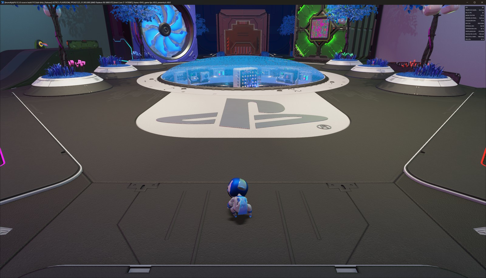
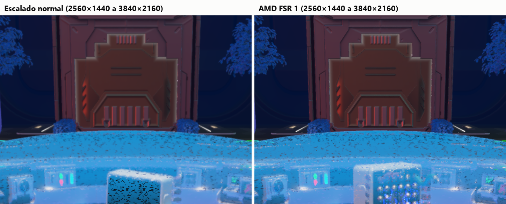
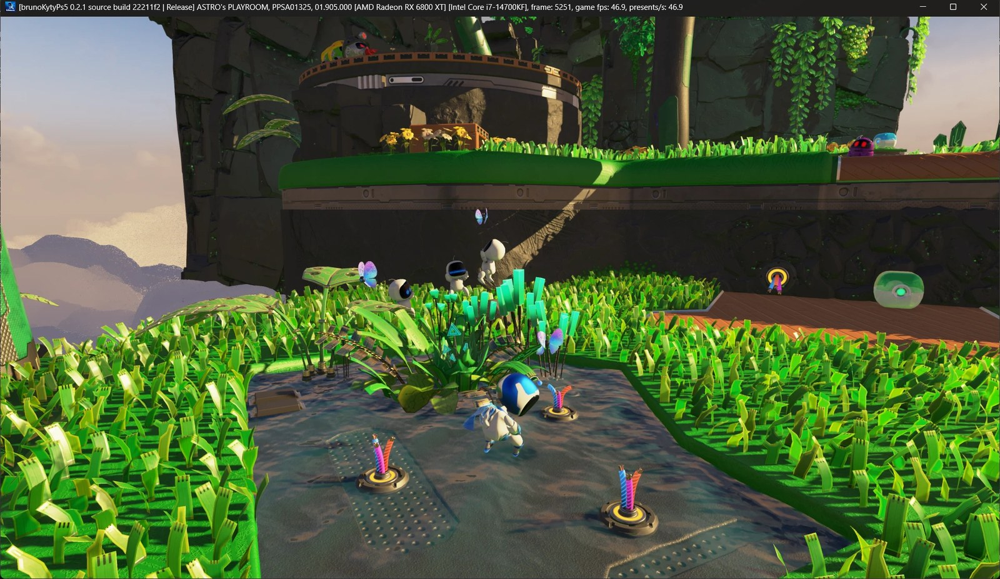
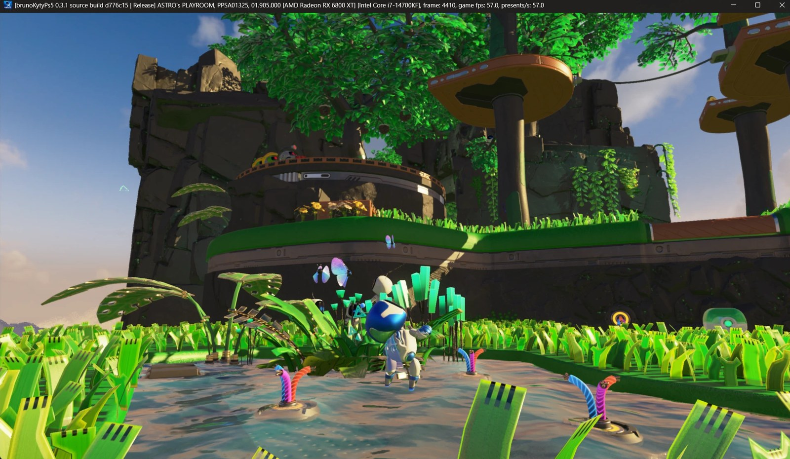
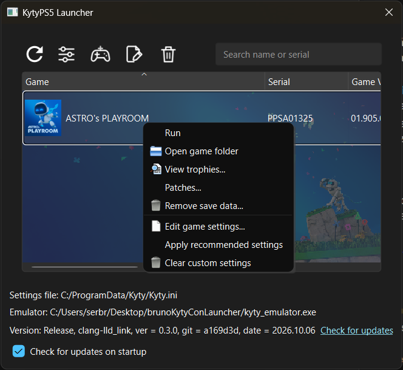

# brunoKytyPs5

Fork del emulador de PlayStation 5 [KytyPS5](https://github.com/KytyPS5/KytyPS5), hecho a partir
de [BryKytyPS5](https://github.com/BryanKAdams/BryKytyPS5). Todo el crédito del emulador es de
esos proyectos y de [Kyty](https://github.com/InoriRus/Kyty), en el que se basan.

## Objetivo

Subir los cuadros por segundo en tarjetas **AMD RDNA 2** (Radeon RX 6000), la misma arquitectura
gráfica de la PS5.

| | |
| --- | --- |
| Equipo de pruebas | Radeon RX 6800 XT, Intel Core i7-14700KF, Windows 11 |
| Juego de referencia | ASTRO's PLAYROOM (PPSA01325) |
| Punto de partida | 34–44 fps en juego (GPU Jungle y CPU Plaza) |
| Ahora (0.4.0) | 60 fps en CPU Plaza; en GPU Jungle, 57 fps en la entrada y 39 en lo más cargado (1440p con FSR) |
| Meta | 60 fps estables |

Sin generación de cuadros.

## Estado

Versión **0.4.0**. Medido en la RX 6800 XT, leyendo los fps que el emulador escribe en el título.

**Nuevo en 0.4.0 — menos trabajo del procesador por dibujo.** La entrada de GPU Jungle pasa de
46,9 a 57,0 fps, CPU Plaza se queda clavada en 60 con margen y jugando hay muy pocos tirones.
Lo más cargado de la selva sigue lejos de 60 (38,7 fps en la escalera del acantilado): para eso
hace falta que el juego emita menos dibujos, no más recortes. La primera vez que se abre un juego
con esta versión vuelve a compilar sus shaders (la caché de la anterior no sirve), así que los
primeros minutos tienen tirones que luego no vuelven.

**De la 0.3.1 — L2 y R2 con presión.** Los juegos que distinguen entre apretar el gatillo suave y
apretarlo a fondo ya lo notan: en la escalada de GPU Jungle los agarres frágiles (los rosas) se
rompen al apretar a fondo.


| Zona | Antes | 0.3.0 | 0.4.0 |
| --- | --- | --- | --- |
| CPU Plaza, dibujando a 3840×2160 | 43,6 fps (base heredada) · 50,3 fps (0.2.0) | 51,8 fps | 52,1 fps (la limita la tarjeta) |
| CPU Plaza, dibujando a 2560×1440 con FSR | — | 60,0 fps, con el hilo de gráficos al 99 % | **60,0 fps**, con el hilo al 95 % |
| GPU Jungle, entrada | 34,0 fps (0.1.0) · 44,5 fps (0.2.0) | 46,9 fps | **57,0 fps** |
| GPU Jungle, más adentro (acantilado) | — | 41–45 fps en otros puntos de la zona | 38,7 fps en el más cargado, la escalera (sin dato anterior del mismo punto) |

Las cifras de la selva hasta la 0.3.0 son dibujando a 3840×2160 y la de la 0.4.0 a 2560×1440 con
FSR; allí limita el procesador y la resolución no cambia los fps (la 0.3.0 daba lo mismo a
3200×1800 que a 3840×2160). La de 52,1 es de una compilación intermedia de la 0.4.0.

«Base heredada» es el fork tal como partió de KytyPS5 y BryKytyPS5 (commit `a9e1ae5`).

### La configuración recomendada: 1440p con FSR a pantalla completa



ASTRO's PLAYROOM dibuja a 3840×2160 y a esa resolución la tarjeta va al límite. Con el parche
que viene en el paquete dibuja a 2560×1440, y el emulador escala la imagen a la pantalla con
**AMD FSR 1** (sus dos pasadas, EASU y RCAS). La plaza pasa a 60 fps estables, y en todo el juego
hay menos tirones porque la tarjeta deja de ir justa. No lleva generación de cuadros: los 60 son
del juego.



Recorte al 100 % de la misma escena, de 2560×1440 a 3840×2160. FSR 1 es el más reciente que se
puede usar aquí: FSR 2, 3 y 4 necesitan vectores de movimiento y profundidad que el juego no
entrega al emulador. Es una casilla por juego (**FSR upscaling**) y `--fsr-upscaling true`; con
`--fsr-softness 0`–`20` se elige cuánto marca los bordes (10 por defecto).

### GPU Jungle: de 34 a 57 fps

| 0.1.0 · 34,0 fps | 0.3.0 · 46,9 fps | 0.4.0 · 57,0 fps |
| --- | --- | --- |
|  |  |  |

El mismo punto de la entrada en las tres; el encuadre de la última no es idéntico.

En la selva limita el procesador, no la tarjeta: el juego emite entre 8000 y 10 600 dibujos por
cuadro y un solo hilo los prepara, con otro que se le adelanta y otro que graba los comandos. Lo
que se ha recortado de ese hilo, cada cosa medida encendiéndola y apagándola en la misma partida
y comprobada contra el camino sin atajo.

En 0.4.0 (a partir de un perfil tomado en la selva, con el hilo de gráficos al 98 %):

- El hilo de gráficos esperaba al que graba los comandos solo para tener hechas unas copias de
  memoria; ahora hace él las que falten y sigue: +2,9 % de dibujos por segundo.
- La validación de los registros se repetía en cada dibujo aunque ningún comando los hubiera
  tocado: −3,1 % de procesador por dibujo.
- El estado dinámico (ventana, recorte, sesgo de profundidad) tampoco se recalcula si el dibujo
  repite destinos, programa y registros: −1,4 a −1,9 %.
- El hilo que se adelanta deja una huella de la especialización de cada shader y el principal
  reconoce su variante por ella, en vez de comparar memoria recién escrita por otro núcleo:
  +2,4 % de dibujos por segundo.
- Los recursos del siguiente dibujo se piden por adelantado: +1,2 %; y se pide solo lo que se
  lee: +0,6 %.
- Candados más ligeros para los tres que se toman en cada dibujo, tablas de vértices que ya no
  se ponen a cero enteras, y una consulta de memoria que ya no espera a un candado ajeno.

Encendidas contra apagadas en la misma partida, las que se pueden conmutar dan entre un 7,5 % y
un 9,6 % más de dibujos por segundo en CPU Plaza (tres pasadas); las demás van aparte.

En 0.3.0:

- Los destinos de render de un dibujo sirven para el siguiente mientras nada de lo que dependen
  cambia: −7,6 % de procesador por dibujo.
- El pipeline del dibujo anterior se toma sin reconstruir su clave: −3,2 %.
- Lo que escribe cada hilo va en su propia línea de caché (los hilos se la quitaban con cada
  comando): −4 %.
- Los datos del siguiente dibujo se piden por adelantado al hilo que se adelanta: −1,2 %.

Probado y descartado, por si alguien lo intenta:

- Actualizar las sombras de las luces quietas un cuadro sí y otro no ahorra un 30 % de dibujos
  con la cámara quieta, pero en la selva las sombras parpadean.
- Fijar los hilos a núcleos distintos no cambia nada.
- Dejar sin proteger las páginas de memoria que el juego reescribe cada cuadro (para ahorrar sus
  1300 fallos de página por cuadro): casi todas se escriben cada varios cuadros o tienen una
  textura encima, y darlas por escritas siempre multiplica por seis lo que se sube a la tarjeta.
- Comparar los registros de cada dibujo por una huella: calcularla cuesta más que compararlos.

### También en 0.3.0

- ASTRO's PLAYROOM ya no se cierra en GPU Jungle con «Assertion failed: !pos.IsNan()». Su física
  recibía raíces inversas calculadas como las calcula un procesador Intel; con «AMD CPU patch»
  (`--amd-cpu`, en los ajustes recomendados) se calculan como en la consola, sin atrapar cada una
  como excepción, gracias a los cambios de KytyPS5 que se incorporaron.
- Generación de cuadros con AMD FSR 3, opcional y apagada por defecto.

### En el lanzador



- **Apply recommended settings** (clic derecho sobre el juego) pone los ajustes con los que el
  juego va mejor; para ASTRO's PLAYROOM, entre otros: pantalla completa, FSR upscaling y AMD CPU
  patch. El juego los recibe además solo la primera vez que aparece.
- **Patches...** activa o desactiva los parches del juego. El paquete trae
  `_Patches/PPSA01325.json` con tres: los dos que apagan la iluminación global por trazado de
  rayos y el que hace que el juego dibuje a 2560×1440. Para volver a 3840×2160, desmarca ese.
- En los ajustes de cada juego hay casillas para FSR upscaling, generación de cuadros y lectura
  relajada.

## Cómo se trabaja

Se mide dónde se va el tiempo de cada cuadro, se cambia una sola cosa y se vuelve a medir en la
misma escena. Lo que no mejora la medición no se queda. Cada mejora se anotará aquí con sus
números.

También se irán incorporando los cambios recientes de KytyPS5 que ayuden al rendimiento.

## Compilar (Windows)

Hace falta Git, CMake, Ninja, Visual Studio Build Tools 2022 con clang-cl, y `glslangValidator`
en el `PATH`. Solo el emulador, sin el lanzador:

```powershell
git submodule update --init --recursive
cmake -S . -B _Build/windows-no-qt -G Ninja -DCMAKE_BUILD_TYPE=Release -DCMAKE_C_COMPILER=clang-cl -DCMAKE_CXX_COMPILER=clang-cl -DKYTY_BUILD_LAUNCHER=OFF
cmake --build _Build/windows-no-qt --target kyty_emulator
```

El fork se desarrolla y se prueba solo en Windows.

## Más información

- Trabajo de rendimiento en AMD heredado de BryKytyPS5: [docs/performance-amd.md](docs/performance-amd.md)
- Documentación general del emulador: [KytyPS5](https://github.com/KytyPS5/KytyPS5)

## Licencia

GPL-2.0, como el proyecto original. Ver [LICENSE](LICENSE).

No está afiliado a Sony Interactive Entertainment ni a PlayStation. No distribuye juegos ni
software del sistema.
